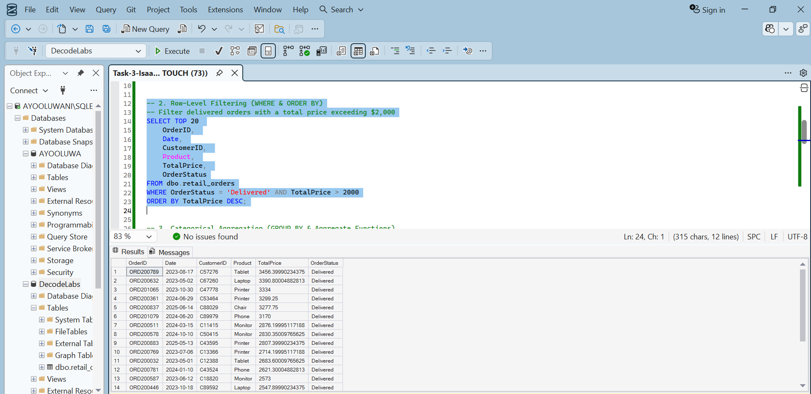
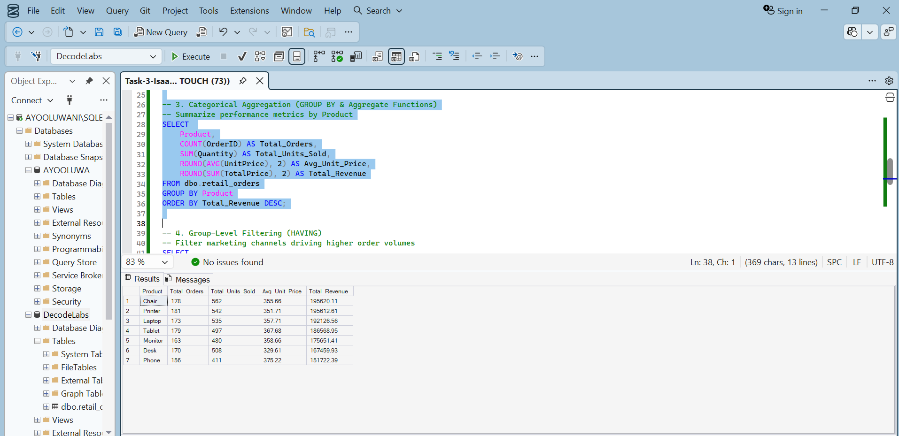
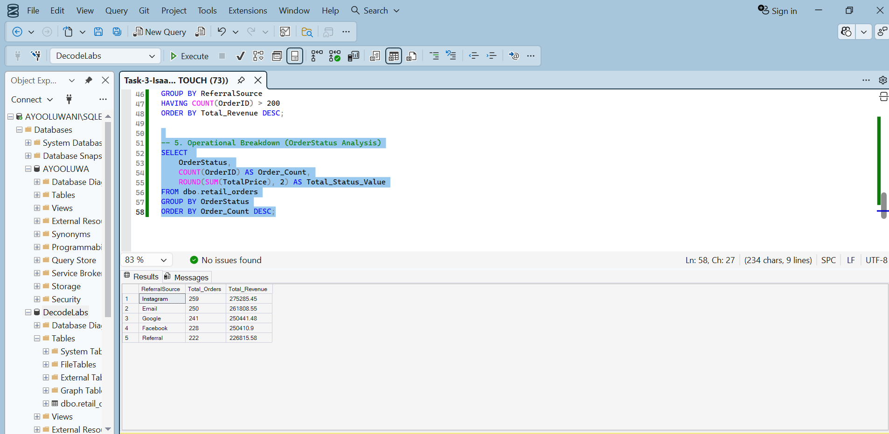

# INTERNSHIP PROJECTS PORTFOLIO

---

## Overview

This repository contains data analysis projects completed during the DecodeLabs Internship. The projects focus on data cleaning, preparation, transformation, and exploratory data analysis (EDA) to generate meaningful insights from raw datasets.

---

## Project 1: Data Cleaning and Preparation

### Project Description
The purpose of this project was to clean and prepare raw business data for analysis using Microsoft Excel and Power Query. Several data quality issues such as duplicates, missing values, inconsistent formatting, and incorrect data types were identified and corrected.

### Objectives
* Improve overall data quality • Remove duplicate records • Handle missing values • Standardize data formats • Prepare the dataset for analysis and reporting

### Tools Used
* Microsoft Excel • Power Query

### Dataset Information
The dataset contains business and operational records used for analytical reporting and data-driven decision-making.

### Data Cleaning Process
The following cleaning operations were performed using Power Query:

1. Removed duplicate rows
2. Handled missing values
3. Standardized text formatting

### Messy Dataset
Initial raw dataset before cleaning and transformation.

### Power Query Techniques Used
* Remove Duplicates • Replace Values • Change Data Types • Additional Columns • Filtering and Sorting • Data Transformation

---

### Power Query Transformation Steps
Power Query was used to clean, transform, and standardize the dataset.

---

### Cleaned Dataset
Dataset after cleaning and preparation using Power Query.

### Challenges Faced
* Missing values • Duplicate records • Inconsistent formatting • Incorrect data types

### Outcome
The raw dataset was successfully transformed into a clean, organized, and analysis-ready dataset suitable for reporting and further analysis.

---
# Project 2: Exploratory Data Analysis (EDA)

## Project Description

This project focuses on exploring and analyzing data using Microsoft Excel to identify trends, patterns, relationships, and business insights.

## Objectives

• Analyze trends and patterns in the dataset • Summarize data using descriptive statistics • Identify key performance observations

## Tools Used

• Microsoft Excel • Pivot Tables • Descriptive Statistics • Quartile Calculations

## Analysis Performed

The following analyses were conducted: • Descriptive statistical analysis • Pivot table analysis • Quartile calculations • Trend analysis • Category comparisons • Performance analysis

## Analytical Techniques Used

• Mean, Median, and Mode • Minimum and Maximum Values • Standard Deviation • Quartile Analysis • Frequency Distribution • Pivot Table Summarization • Data Filtering and Sorting

---

## Basic Descriptive Statistics

Summary statistics used to understand the dataset distribution.

| Statistics | Total Price |
| :--- | :--- |
| **Count ( Total Orders )** | 1,200.00 |
| **Sum ( Total Sales Revenue )** | $1,264,761.96 |
| **Mean ( Average Unit Price )** | $356.41 |
| **Mode ( Most Frequent Price )** | $127.18 |
| **Median ( Middle Unit Price )** | $364.21 |
| **Min ( Lowest Price )** | $11.39 |
| **Max ( Highest Price )** | $699.93 |

---

## Pivot Table Analysis

Pivot tables used to summarize and analyze trends.

---

## Quartile Analysis

Quartile calculations used to identify data distribution and outliers.

| Quartile Bounds | QUARTILES FOR OUTLIERS DETECTION |
| :--- | :--- |
| **Q1** | 410.52 |
| **Q3** | 1578.48 |
| **IQR** | 1167.96 |
| **Lower Bound** | -1341.41 |
| **Upper Bound** | 3330.41 |

---

## Key Insights

• Certain categories consistently performed better than others • Some values showed high variability across records • Quartile analysis helped identify outliers and distribution patterns • Pivot tables simplified category analysis

## Challenges Faced

• Inconsistent formatting • Large data organization • Data preparation before analysis

## Outcome

The exploratory data analysis provided meaningful insights and improved understanding of the dataset through statistical summaries and trend analysis.

# Project 3: SQL Retail Data Analysis

## Project Overview

This project focused on analyzing the Online Retail Dataset using Microsoft SQL Server and SQL Server Management Studio (SSMS) The objective of the project was to apply SQL querying, data cleaning, filtering, aggregation, and reporting techniques to extract meaningful business insights from retail transaction data.

## Tools Used

* Microsoft SQL Server • SQL Server Management Studio • Sql

* ## Database Setup and Data Cleaning

The raw dataset was initialy cleaned in Excel to ensure data consistency, exported to a CSV format, and successfully imported into SQL Server. Data cleaning and transformation processes were carried out to improve data quality and prepare the dataset for analysis.

The following cleaning tasks were performed:
* Replaced blank values in the Coupon Code column with "No Coupon"
* Verified and adjusted data types where necessary

  ## Table Created

### Top 10 Table Displayed

 • AVG() • COUNT()

### Additional SQL Techniques
* Date extraction functions • Conditional filtering • Data aggregation • Business reporting queries

* ## Filtering Records

`WHERE` clause used to filter records

## GROUP BY Clause

Product grouped by Order Id, Quantity, Unit Price, Total Price

## HAVING Clause

Analyzed queries with HAVING

## Sorting Records; ORDER Clause

`ORDER BY` used to sort records

## Overall Metrics Performance

| Metric | Value |
| :--- | :--- |
| **Total Orders** | 1,200 |
| **Total Revenue** | 1,264,761.96 |
| **Average Order Value** | 1,053.97 |
| **Average Quantity Ordered** | 2 Items |
| **Cancelled Orders** | 251 |

## Product Performance

### Top 3 Products by Revenue

| Product | Revenue |
| :--- | :--- |
| **Chair** | 195,620.11 |
| **Printer** | 195,612.61 |
| **Laptop** | 192,126.56 |
| **Tablet** | 186,568.95 |
| **Monitor** | 175,651.41 |
| **Desk** | 167,459.93 |
| **Phone** | 151,722.39 |

#### Revenue by Referral Source

| Referral Source | Total Revenue |
|---|---|
| Instagram | 275,285.45 |
| Email | 261,808.55 |
| Google | 250,441.48 |
| Facebook | 250,410.90 |
| Referral | 226,815.58 |

## Conclusion

This project demonstrated practical SQL and data analysis skills through the use of queries that were effectively used to clean, organize, analyze, and summarize transactional data for key business insights.

The analysis provided visibility into:
* Customer behavior
* Product performance
* Operational status distribution

Overall, the project strengthened foundational SQL skills and showcased the ability to transform raw data into meaningful business intelligence suitable for reporting and decision-making.

