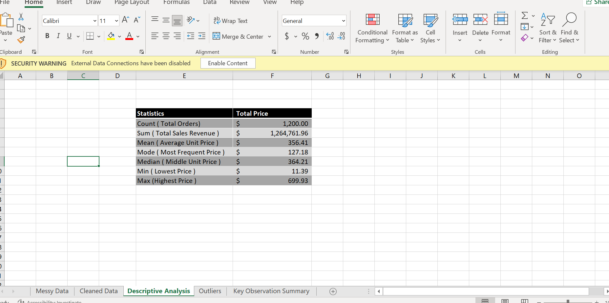
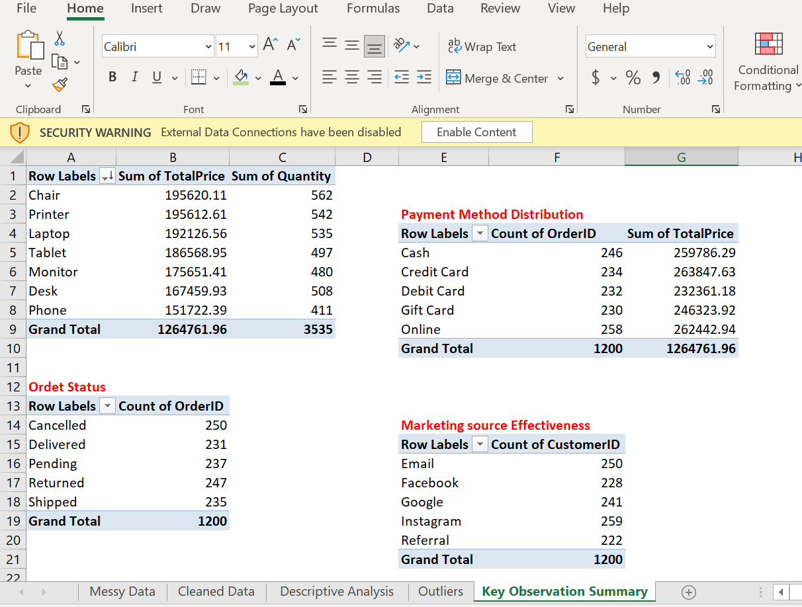
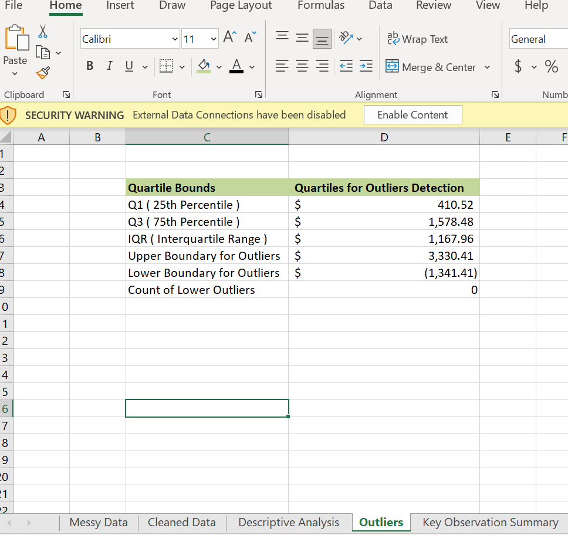

# INTERNSHIP PROJECTS PORTFOLIO

---

## Overview

This repository contains data analysis projects completed during the DecodeLabs Internship. The projects focus on data cleaning, preparation, transformation, and exploratory data analysis (EDA) to generate meaningful insights from raw datasets.

---

## Project 1: Data Cleaning and Preparation

### Project Description
The purpose of this project was to clean and prepare raw business data for analysis using Microsoft Excel and Power Query. Several data quality issues such as duplicates, missing values, inconsistent formatting, and incorrect data types were identified and corrected.

### Objectives
* Improve overall data quality • Remove duplicate records • Handle missing values • Standardize data formats • Prepare the dataset for analysis and reporting

### Tools Used
* Microsoft Excel • Power Query

### Dataset Information
The dataset contains business and operational records used for analytical reporting and data-driven decision-making.

### Data Cleaning Process
The following cleaning operations were performed using Power Query:

1. Removed duplicate rows
2. Handled missing values
3. Standardized text formatting

### Messy Dataset
Initial raw dataset before cleaning and transformation.

### Power Query Techniques Used
* Remove Duplicates • Replace Values • Change Data Types • Additional Columns • Filtering and Sorting • Data Transformation

---

### Power Query Transformation Steps
Power Query was used to clean, transform, and standardize the dataset.

---

### Cleaned Dataset
Dataset after cleaning and preparation using Power Query.

### Challenges Faced
* Missing values • Duplicate records • Inconsistent formatting • Incorrect data types

### Outcome
The raw dataset was successfully transformed into a clean, organized, and analysis-ready dataset suitable for reporting and further analysis.

---
# Project 2: Exploratory Data Analysis (EDA)

## Project Description

This project focuses on exploring and analyzing data using Microsoft Excel to identify trends, patterns, relationships, and business insights.

## Objectives

• Analyze trends and patterns in the dataset • Summarize data using descriptive statistics • Identify key performance observations

## Tools Used

• Microsoft Excel • Pivot Tables • Descriptive Statistics • Quartile Calculations

## Analysis Performed

The following analyses were conducted: • Descriptive statistical analysis • Pivot table analysis • Quartile calculations • Trend analysis • Category comparisons • Performance analysis

## Analytical Techniques Used

• Mean, Median, and Mode • Minimum and Maximum Values • Standard Deviation • Quartile Analysis • Frequency Distribution • Pivot Table Summarization • Data Filtering and Sorting

---

## Basic Descriptive Statistics

Summary statistics used to understand the dataset distribution.

| Statistics | Total Price |
| :--- | :--- |
| **Count ( Total Orders )** | 1,200.00 |
| **Sum ( Total Sales Revenue )** | $1,264,761.96 |
| **Mean ( Average Unit Price )** | $356.41 |
| **Mode ( Most Frequent Price )** | $127.18 |
| **Median ( Middle Unit Price )** | $364.21 |
| **Min ( Lowest Price )** | $11.39 |
| **Max ( Highest Price )** | $699.93 |

---

## Pivot Table Analysis

Pivot tables used to summarize and analyze trends.

---

## Quartile Analysis

Quartile calculations used to identify data distribution and outliers.

| Quartile Bounds | QUARTILES FOR OUTLIERS DETECTION |
| :--- | :--- |
| **Q1** | 410.52 |
| **Q3** | 1578.48 |
| **IQR** | 1167.96 |
| **Lower Bound** | -1341.41 |
| **Upper Bound** | 3330.41 |

---

## Key Insights

• Certain categories consistently performed better than others • Some values showed high variability across records • Quartile analysis helped identify outliers and distribution patterns • Pivot tables simplified category analysis

## Challenges Faced

• Inconsistent formatting • Large data organization • Data preparation before analysis

## Outcome

The exploratory data analysis provided meaningful insights and improved understanding of the dataset through statistical summaries and trend analysis.
